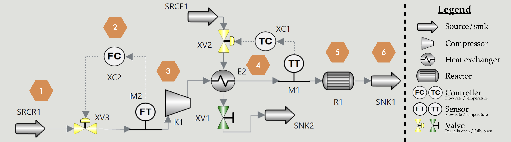

# Inductive Logic Programming for Detecting Chemical Process Failures: Ethylene Oxidation Case Study

## Main Case Study

We simulated a simple ethylene oxidation process using the kinetics from Stoukides and Pavlou [1] to generate failure data. We then used DisPLAS [2], a Learning from Answer Sets framework, to learn probabilistic rules for failure detection and investigate the feasibility of this approach. Validation against 20% of the data was performed on these learned rules, and classification performance was compared to neural baseline models.

The results of this main case study can be found under 'results/dynamic/'. To regenerate them, run `./tryouts.sh`, which will create the directory '~/Desktop/results/' and start populating it with the results from each run of the validation pipeline.


Figure 1: Flowsheet of the simulated process

## Sensor Cost Optimization Extension

We selected the main process parameters that could be measured in the real world (from steps 2-6 of Figure 1) and assumed sensor purchase costs dependent on the type of sensor. We then conducted investigations to find the cheapest set of sensors with minimal compromise on classification performance.

The results of this extension can be found in 'results/cost_opt_dynamic/'. To regenerate them, run `./cost_opt_tryouts_post_hoc.zsh && ./cost_opt_tryouts_embedded.sh`, which will create the directory '~/Desktop/results/' and start populating it with the results from each run of the validation pipeline.

### Post-Hoc

We used the default settings from the main case study and looked at different subsets of sensors. Based on the average area under the curve (AUC) produced from the receiver operating characteristic (ROC) curves we computed different measures of AUC-cost compromise, trying different values for $\alpha$, $\beta$ and $\lambda$:

$$
Acc_{sc}^{\alpha,\beta} = \frac{\overline{AUC}^\alpha}{cost^\beta}
$$
$$
Acc_{pen}^{\lambda} = \overline{AUC} - \lambda \cdot \frac{cost}{\max(cost)}
$$

### Embedded

We used standard FastLAS [3] instead of DisPLAS to enable embedding cost minimization bias constraints into the learning task. As a first step we saved the example coverage penalty of the optimal hypothesis as $cov_{pen}^{opt}$; then we added a bias constraint to limit the allowed example coverage penalty to $\beta \cdot cov_{pen}^{opt}$, along with an additional "sensor cost" term to the hypothesis costing function:

$$
S(H,T) = 100 \cdot |uncov(H,T)| \; + \sum_{h\in H}{(50 + 5 \cdot |body(h)|)} + \alpha \cdot \sum_{s\in sensors(H)}{cost(s)}
$$

## Technologies Used

To simulate the process and generate failure data we used [Aveva Process Simulation](https://www.aveva.com/en/products/process-simulation/) 2024.2.0 (Windows only). The rest of the code was run on macOS and is likely to also work on Linux but this was not tested.

To run the main case study pipeline and the cost optimization variants, the following software is required:
- [bash](https://cgit.git.savannah.gnu.org/cgit/bash.git) (installed on Unix by default)
- [zsh](https://github.com/ohmyzsh/ohmyzsh/wiki/Installing-ZSH/3b6a919e724c10fb94bbf879b0de4655053cdcbf) (often pre-installed on Unix)
- [Python](https://www.python.org/downloads/) 3.10+ (we used version 3.13.5)
- [Miniconda](https://www.anaconda.com/docs/getting-started/miniconda/install) (we used version 24.11.3)
- [clingo](https://github.com/potassco/clingo) (we used version 5.8.0)
- [FastLAS](https://spike-imperial.github.io/FastLAS/installation.html) 2 with the DisPLAS extension

### Setup Instructions

1. Install the required software
2. Create a new conda environment with the name of your choosing using the provided 'requirements.txt': `conda create --name <NAME> --file requirements.txt`
3. Navigate to 'validate/validate.sh':
    1. Verify that your machine has a `~/miniconda3/etc/profile.d/conda.sh`; if not set CONDA_PATH (line 1) to the correct path
    2. Edit CONDA_ENV (line 2) to the name that you chose when creating the conda environment

You should now be able to (pass `--help` for guidance with Python script parameters):
- Generate new learning tasks from the data in the DB ('database/generate_task.py')
- Run any learning task (`FastLAS --opl [--prob-solve] train.las bias.las [bias_extra.las]`)
- Run the pipeline for generating a task with full validation* ('validate/validate.sh')
- Regenerate the main case study results ('validate/tryouts.sh')
- Regenerate post-hoc cost optimization results ('validate/cost_opt_tryouts_post_hoc.zsh')
- Regenerate embedded cost optimization results ('validate/cost_opt_tryouts_embedded.sh')
- Run the baselines independently ('baseline/run_baseline.py')

Please direct any questions regarding setup instructions to: julien.amblard16@imperial.ac.uk.

## Repository Structure

The structure of this repository is shown and explained below:
```
├── README.md                          --> this file
├── baseline
│   └── run_baseline.py                --> runs the baselines
├── database
│   ├── generate_task.py               --> generates an ILP task
│   ├── knowledge.db.zip               --> a zip of the main database (containing process and sampled failure data from simulation)
│   └── short_terms.csv                --> optional custom t_short_terms
├── logic
│   ├── static                         --> static DisPLAS task
│   │   ├── bias.las
│   │   ├── bias_extra.las
│   │   └── train.las
│   ├── dynamic                        --> dynamic DisPLAS task
│   │   ├── bias.las
│   │   ├── bias_extra.las
│   │   └── train.las
│   ├── cost_opt_dynamic               --> embedded cost optimization FastLAS task
│   │   ├── bias.las
│   │   ├── bias_extra.las             --> extra bias constraints for cost minimization
│   │   └── train.las
├── requirements.txt
├── results                            --> obtained results from having run validate.sh and its variants
│   ├── static                         --> cause-effect relations in process
│   │   └── rules.txt
│   ├── dynamic                        --> main case study
│   │   └── ...
│   └── cost_opt_dynamic
│       ├── embedded                   --> cost optimization extension: embedded
│       │   ├── alpha
│       │   │   ├── ...
│       │   │   └── res.csv
│       │   └── beta
│       │       ├── ...
│       │       └── res.csv
│       └── post_hoc                   --> cost optimization extension: post-hoc
│           └── ...
├── simulation
│   ├── aveva_models                   --> process simulation files
│   │   ├── dynamic_sim.simx
│   │   └── static_sim.simx
│   ├── flowsheet.png                  --> process flowsheet
│   ├── sampling_results               --> contains the sampled failure data from the simulation (also in DB)
│   │   └── ...
│   ├── side_experiments               --> plots showing the effect of varying process parameters in static mode
│   │   └── ...
│   └── topology
│       ├── component_order.asp        --> ASP code to generate paths from node pairs
│       ├── parse_topology.py          --> parses the topology dump
│       └── topology.json              --> a dump of the structure of the simulated process
└── validate
    ├── compute_metrics.py             --> computes the rule metrics
    ├── confusion_matrix.py            --> generates a confusion matrix
    ├── cost_opt_sensor_choices.asp    --> generates answer sets of sensors for post-hoc cost optimization
    ├── cost_opt_tryouts_embedded.sh   --> variant of tryouts.sh for embedded cost optimization
    ├── cost_opt_tryouts_post_hoc.zsh  --> variant of tryouts.sh for post-hoc cost optimization
    ├── count_binary_classif.asp       --> counts tp/fp/tn/fn from generated rules
    ├── gen_validation_examples.py     --> generate program from a single simulation run to check rule prediction
    ├── plot_roc.py                    --> plots the ROCs
    ├── read_results_dir.zsh           --> formats results from having run validate.sh
    ├── tryouts.sh                     --> runs validate.sh with different learning parameters
    └── validate.sh                    --> main pipeline for learning rules given a set of learning parameters
```

[1] Stoukides, M., & Pavlou, S. (1986). Ethylene oxidation on silver catalysts: effect of ethylene oxide and of external transfer limitations. _Chemical Engineering Communications, 44_(1-6), 53-74.

[2] https://ilasp.com/ProbFastLAS_summary.pdf

[3] Law, M., Russo, A., Broda, K., & Bertino, E. (2021). Scalable Non-observational Predicate Learning in ASP. In _IJCAI_ (pp. 1936-1943).